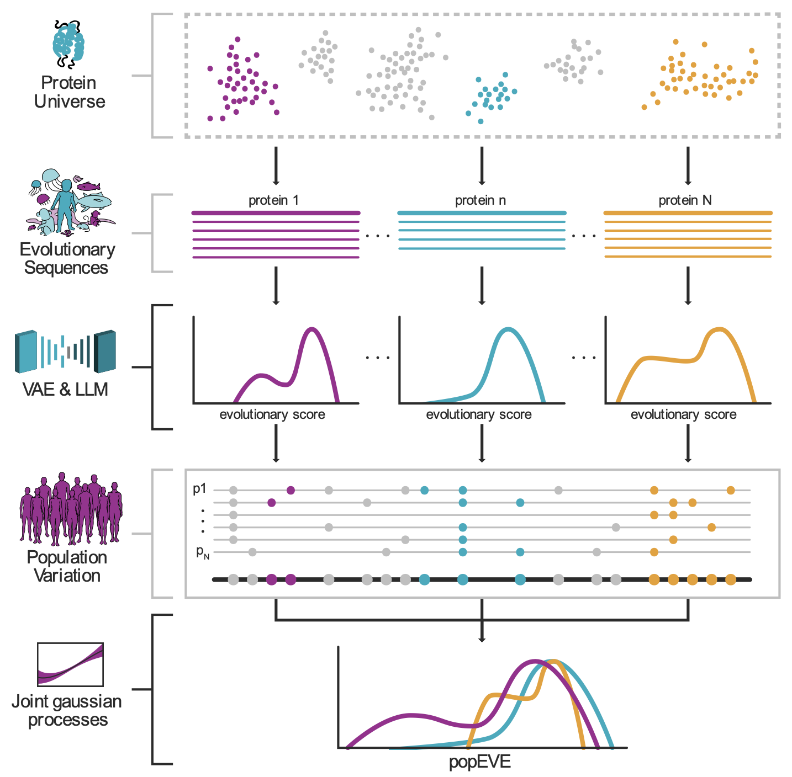

This is the code repository for the paper [Deep generative modeling of the human proteome reveals over a hundred novel genes involved in rare genetic disorders](https://www.medrxiv.org/content/10.1101/2023.11.27.23299062v1); A collaboration between the [Marks Lab](https://www.deboramarkslab.com/) and [Dias and Frazer Group](https://www.crg.eu/en/programmes-groups/dias-frazer-lab). We also provide a website [pop.evemodel.org](https://pop.evemodel.org/) for exploring model predictions on a protein by protein basis, as well as bulk downloads.

# Overview
popEVE is a model designed to place missense variants on a proteome-wide, human-specific spectrum of pathogenicity. The figure below provides a summary of the full popEVE framework.




Genetic variation seen in the human population and across the tree of life provide complementary information for building a proteome-wide model of pathogenicity. Cross-species data enables missense resolution predictions, while variation seen in the human population can be used to obtain a proteome-wide, human-specific measure of constraint. The code provided here is designed to achieve this second step. It takes as input predictions for all single amino acid substitutions from a model trained on cross-species data, together with whether or not that variant has been seen in a given cohort of interest, and trains a new model to predict the presence or absence of a variant in that cohort, conditioned on the score from the input model.

# Data Requirements
In the paper, we used scores from EVE and ESM-1v as our cross-species scores, and UK Biobank data was used as our human cohort. Example training files can be found in the `data` folder. However, this code can be used with any model and any human cohort.

# Examples
An example bash script for running this code is here `train_popEVE_models.sh`. All output will appear in the `results` directory.

# Software requirements
The entire codebase is written in python. Package requirements are as follows:
  - python
  - pytorch
  - gpytorch
  - pandas
  - tqdm

The corresponding environment can be created via conda with the popeve_env.yml file as follows:
```
  conda env create -f popeve_env.yml
  conda activate popeve_env
```

## License
This project is available under the MIT license.

## Reference
If you use this code, please cite the following paper:
```bibtex
@article{orenbuch2023deep,
  title={Deep generative modeling of the human proteome reveals over a hundred novel genes involved in rare genetic disorders.},
  author={Orenbuch, Rose and Kollasch, Aaron W and Spinner, Hansen D and Shearer, Courtney A and Hopf, Thomas A and Franceschi, Dinko and Dias, Mafalda and Frazer, Jonathan and Marks, Debora S},
  journal={medRxiv},
  pages={2023--11},
  year={2023},
  publisher={Cold Spring Harbor Laboratory Press}
}
```
